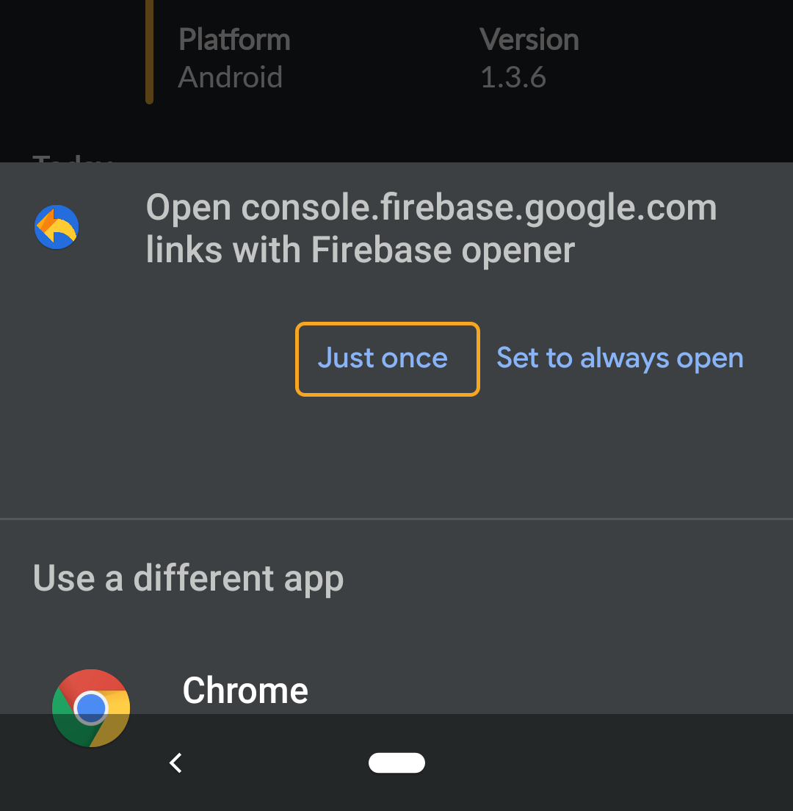
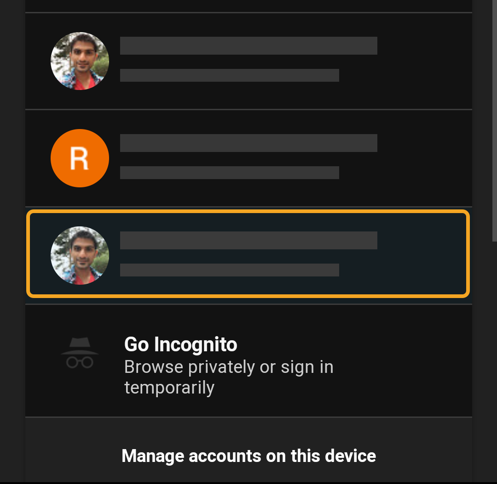
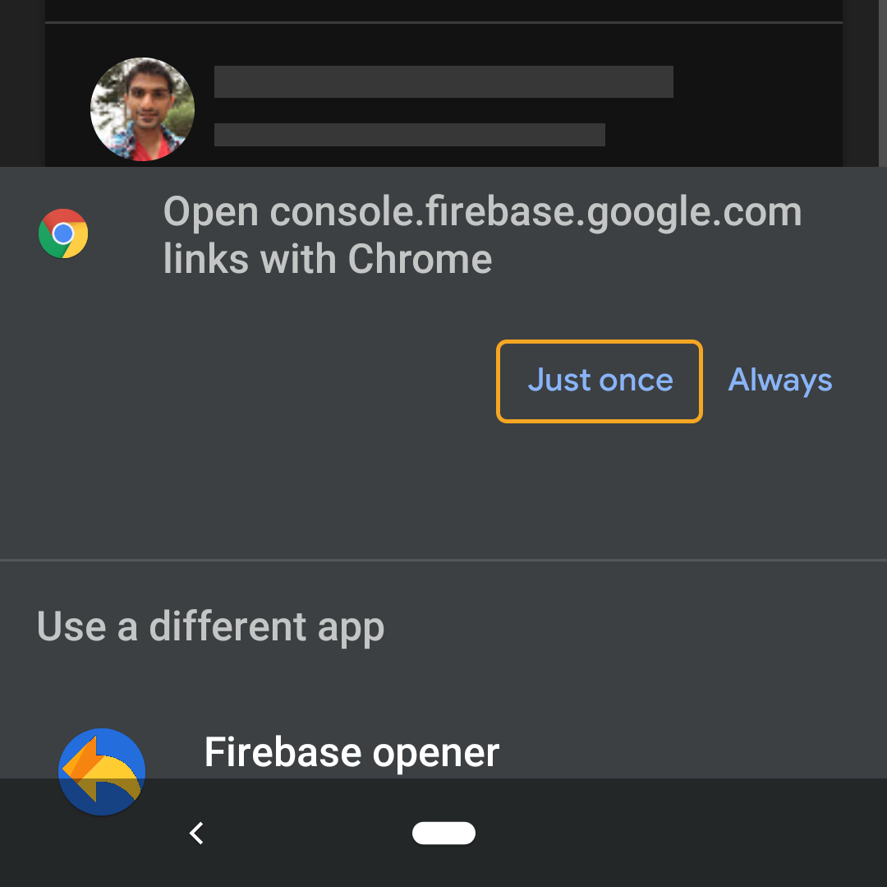

# Firebase Opener

A little utility app to open links that redirect to Google Account selector before redirecting to the firebase console.

## Usage:
1. Open links to Firebase Console (`https://console.firebase.google.com/*`) from any app.
2. In the selector dialog, select `Just once` for Firebase opener:

    
3. Select appropriate Google Account where the link belongs:

    

4. This will set the session for that Google user and try to open the Firebase Console URL (`https://console.firebase.google.com/*`) again. This time, we want to select the browser again, because the session is appropriately set:

    

## Author:
Raxit Majithiya ([@raxityo](https://twitter.com/raxityo))

## License:
raxityo • MIT License © 2020
